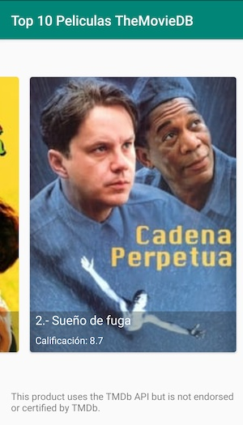

# Ejercicio Android

## Objetivo
Desarrollar una aplicación para Android usando Java, la cual permita consultar el top 10 de las mejores películas clasificadas del sitio web [TheMovieDB](https://www.themoviedb.org/). Mostrando los posters de las mismas en un carousel, y que al presionar sobre alguna de ellas se muestre el detalle de la misma.

### Librerías utilizadas

* Constraint Layout
* Retrofit
* Gson
* ButterKnife
* RecyclerView
* Cardview
* Picasso

#### A continuación se muestran capturas de pantalla de la aplicación

 &nbsp;&nbsp;&nbsp;&nbsp;&nbsp;&nbsp;&nbsp;&nbsp;&nbsp;&nbsp;&nbsp;&nbsp;&nbsp; 

